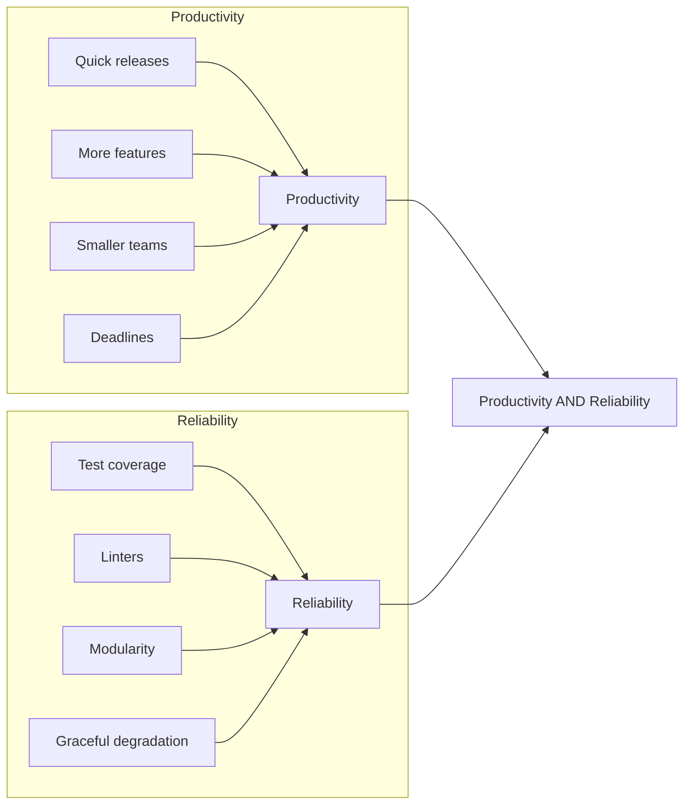
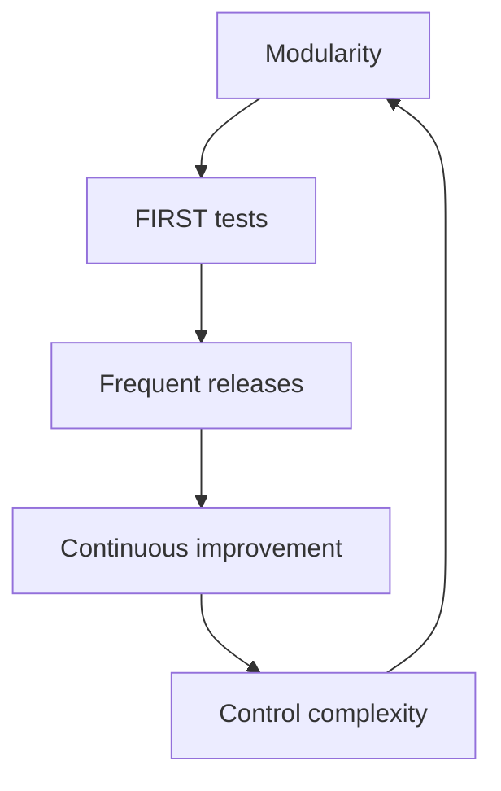

# Course transcripts

Crafting code that is easy to and maintain.

## Purpose

Build habits for productivity and reliability.

## Modularity

Modularity is the practice of breaking down code into smaller pieces. This makes it easier to understand, test, and maintain. 

However, cutting code arbitrarily can lead to confusion. Instead, follow these principles:

### Separate by lifecycle

Keep stable code separate from evolving code.
The feature to "display the color manual" can change by user-preference.
Hence, separate it from "color-pair mapping", which goes by the standard.

### Name by purpose

Names for files, classes, or functions should be self-evident.
A good name conveys purpose - without digging further into their code or comments.
This saves time when reading code.

### Avoid side effects

Side effects are changes to state - display, storage, network, etc.
They bring dependency. Isolate your logic into pure functions that return a value without changing the state.
Keep dependencies separate.

### Inject dependencies

When it isn't possible to isolate with pure functions, inject dependencies.
Pass in the dependencies as parameters, rather than hardcoding them.
This makes it easy to mock the dependencies in tests, and to swap them out in production.

## Tests

Follow the FIRST principles for writing tests:

| Principle | Enables | Benefits |
|-----------|---------|----------|
| Fast      | Frequent execution | Find issues early |
| Independent| Isolation of tests | Easier failure diagnosis |
| Repeatable | Consistent results | Stable tests, low maintenance |
| Self-validating| Automatic pass/fail | Reduced manual effort - single Pass/Fail result |
| Thorough   | Coverage with strong asserts | Passing tests ensure customer satisfaction |

## Preventing issues by shifting left

Static analysis and SAST tools can catch common issues while coding, without having to run the code.
This is known as "shifting left" - catching issues earlier in the development process.

Here is a sample list of linters, with rules built by language experts:

| Language | Linter |
|-----------|---------|
| C++ | cpplint, cppcheck |
| C#        | Resharper / Roslyn Analyzers |
| Java     | Checkstyle, PMD |
| JavaScript| ESLint |
| Python    | Pylint, flake8 |

## Circle of value

The circle of value is a cycle of writing code, testing it, and then refactoring it to improve its quality.
This cycle keeps the code healthy and easy to maintain.
It's like brushing your teeth - do it every day to keep your teeth healthy.

## Recognize design principles

The circle of virtue usually results in code that follows these principles:

| Principle | Description |
|-----------|-------------|
| Single Responsibility Principle | One reason to change |
| Open/Closed Principle | Add features without having to change existing code |
| Interface Segregation Principle | Segregate dependencies by "single responsibility" |
| Dependency Inversion Principle | Depend on abstractions, e.g., by injection |
